# Aerodynamics model

Author: Vilgot Lötberg, vilgotl@kth.se, 0725079097

<h2>Background</h2>

This article will treat the modelling of the aerodynamic moments around a flying body 
using a tensor-based approach. The method described takes into account the geometry 
of the body and the non-linearity of lifting moments distributed along its sides, 
though it does not take into account any fluid-mechanics interaction between different 
surfaces, nor the differences between supersonic and subsonic airflow.

The model is primarily intendet to be used in conjunction with the equations of motion 
to simulate rocketry/aircraft control/aerodynamic behavior in flight.

It can also be seen as an unintentional study of polynomials.

<h2>Introduction</h2>

A common way to describe aerodynamic bodies is to use the 'center of pressure' -approach, 
where all the aerodymamic forces are assumed to act from a single point on the body.

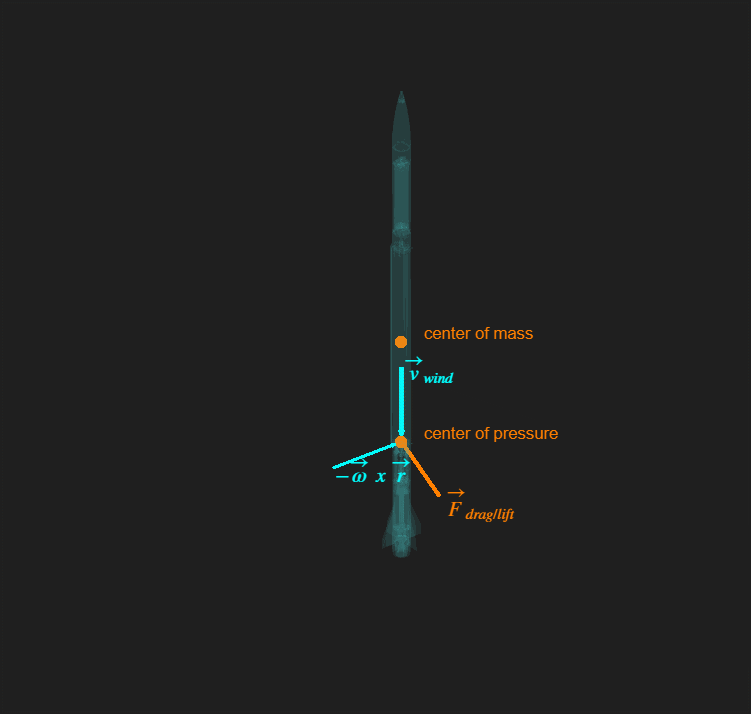
>*Fig 1: aerodynamic forces acting from center of pressure*

While useful to get an overview of the bodys aerodynamic tendencies, such as whether 
or not its stable in flight, it is not very accurate when it comes to describing the 
actual aerodynamic behaviour of the body.

To understand why, intuition must be gained about the non-linear nature of the moment 
generated by the aerodynamic force. In the example above, the moment resulting from the 
aerodynamic force would simply be modelled as:

$$ \vec{M} = \vec{r} \times \vec{F} $$

However, by instead considering the infitesimal area-elements along the bodys broadside, 
and considering the pressure applied to each in its normal direction from, for example, 
the rockets rotation, it paints a different picture. Assuming no relative velocity, and 
looking only at the contribution from the body's own rotation, the velocity distribution 
along its side becomes the following:

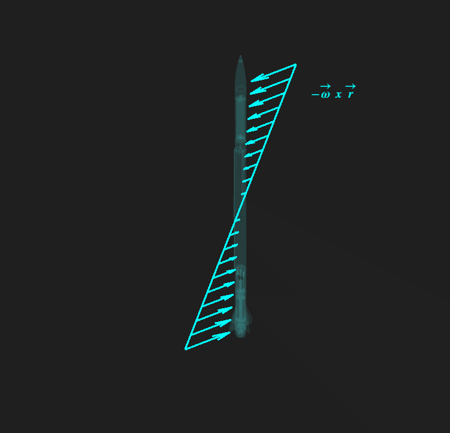
>*Fig 2: velocity distribution along broadside under pure rotation*

Consider now the simplified equation of drag/lift as given by Nasa*:

$$
F = \frac{1}{2} \;\rho \; C_{d/l} \;A \; v^2$$

(*The equation cannot be used as is in a vectorized context, as it maps both positive and 
negative velocities to a positive force. A sign-term must be added in order to map velocities 
to a force in the same corresponding direction, i.e a positive velocity to a positive force, 
and a negative velocity to a negative force):

$$ F = \frac{1}{2} \;\rho \; C_{d/l} \;A \; v^2 \; \text{sign}(v)$$

Considering an infitesimal area segment along the bodys broadside:

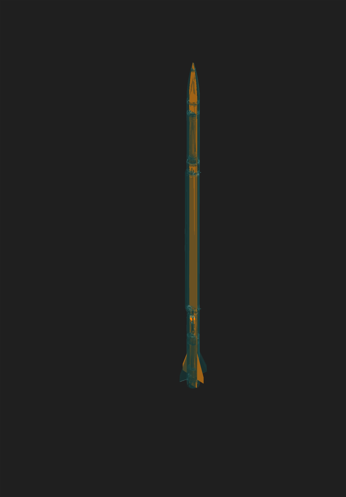
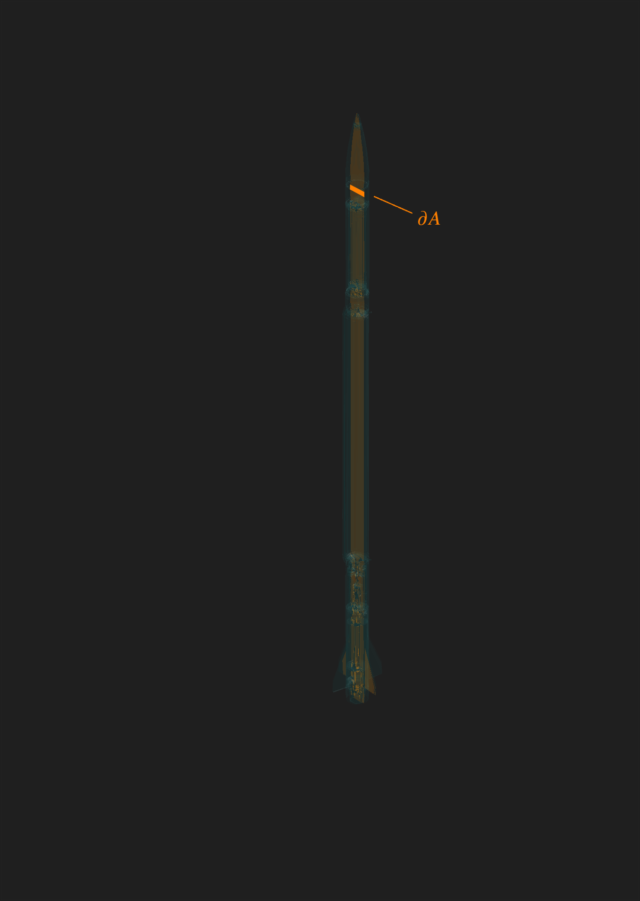
>*Fig 3: "infitesimal" area element*

The force distributed along the broadside as

$$\begin{align}\partial F = \frac{1}{2} \;\rho \; C_{d/l} \;\partial A \; v^2 \; \text{sign}(v)\end{align}$$

thus looks like this:

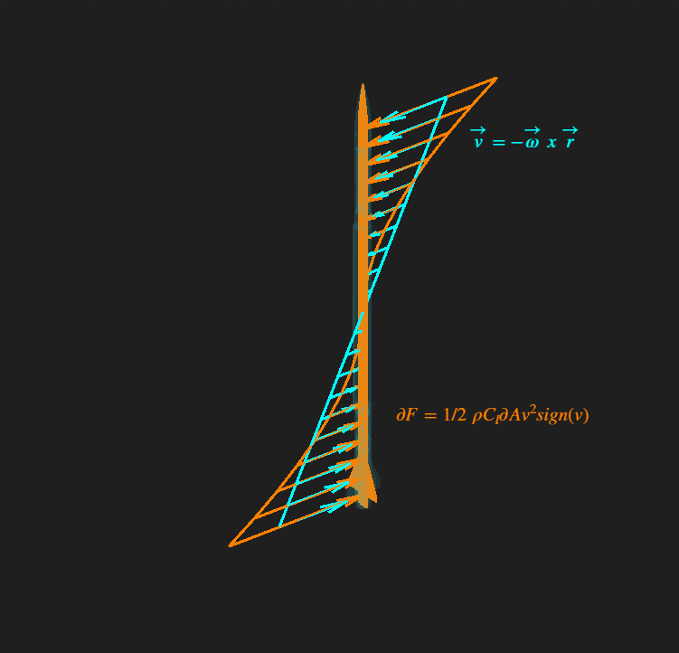
>*Fig 4: force distribution along broadside*

This results in the total moment from all the $\partial F$ contributions being much larger 
than that which would result from assuming a center-of-pressure, and this will be proven 
mathematically later in the paper. What follows is to setup a more accurate model that can 
be used to calculate the moment resulting from the $\partial F$ contributions along the body. 
Initially this model will only be describing the moment in a single direction, though it will 
later be expanded to a vectorized context. The method described is computationally efficient, 
as it bypasses the need to perform expensive integrals during every simulation step. By allowing 
some assumptions, a method can be developed where the simulation-dependant parameters; $v_{wind}, \omega$; 
are simply multiplied by a set of coefficients to get the moment.

<h2>Methodology</h2>

From Fig 4, the moment-equation can be set up as (in a scalar context, will be expanded to a vectorized context later):

$$\begin{align} M = \int_{R} r \partial F = \int_{R} r \frac{1}{2} C_d \rho v^2 sign(v) \partial A\end{align}$$

Once again concidering a small area-element $\partial A$, it can be defined as:

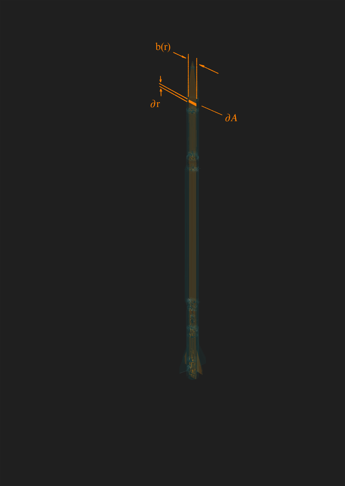
> *Fig 5: parameterization of area-element*

$$\begin{align}\partial A = b(r)\cdot \partial r \end{align}$$

Where $\partial r$ is an infitesimal element along the radial direction, and $b(r)$ is 
the breath its normal direction. Substituting into the moment-equation:

$$\begin{align}(2),(3) \Longrightarrow M = \int_{R} r \frac{1}{2} C_d \rho v^2 sign(v) b(r) \partial r\end{align}$$

The velocity $v$ normal to and experienced by $\partial A$ can be found as:

$$ \begin{align} v = v_0 - \omega r \end{align}$$

Where $v_0$ is a renaming of the normal component of $\vec{v}_{wind}$, see Fig 1.
 Substituting once again into the moment equation gives:

$$\begin{align}(4),(5) \Longrightarrow M = \int_{R} r \frac{1}{2} C_d \rho (v_0 - \omega r)^2 sign(v_0 - \omega r) b(r) \partial r\end{align}$$

The above equation works, though solving an integral for every simulation iteration is not 
ideal. Because of the $b(r)$-term the integral has no convenient analytical solution that 
can be levraged, thus it has to be computed numerically. It would however be convenient if 
all the geometry-dependant terms; $r, \partial r, b(r)$; could be seperated from the 
simulation/physics-dependant terms; $v_0, \omega$, such that the integral could be computed 
once in the beginning of the simulation, and then the resulting coefficients just be reused.
 The sign-term makes this impractical however as is shown below, and has to be dealt with.

<h3>Why getting rid of the sign(v)-term is necessary.</h3>

Even if it's possible to split it up into two integrals for each interval for which 
$sign(v)$ is 1 & -1, solving for the bound where the sign-term flips sign yields:

Searching for $v = 0$:
$$\Longrightarrow v_0 - \omega \cdot r_{flip} = 0 \Longleftrightarrow \boxed{r_{flip} = \frac{v_0}{\omega}}$$

Setting up the integral with these limits yields:

$$ \begin{aligned}
M 
&=  \int_{R} r \frac{1}{2} C_d \rho (v_0 - \omega r)^2 sign(v_0 - \omega r) b(r) \partial r \\
&= \int_{r^-}^{\frac{v_0}{\omega}} r \frac{1}{2} C_d \rho (v_0 - \omega r)^2 b(r) \partial r - 
\int_{\frac{v_0}{\omega}}^{r^+} r \frac{1}{2} C_d \rho (v_0 - \omega r)^2 b(r) \partial r 
\end{aligned}$$

Because of the fact that $\omega$ takes on different values during the simulation, the integration 
bounds change as well. This makes it impossible (and thus impractical) to seperate the terms.

<h3>Approximations for sign(v).</h3>

Plotting part of the integrand $ (v_0 - \omega r)^2 sign(v_0 - \omega r) b(r) $ over $v$ reveals a way to approximate it:

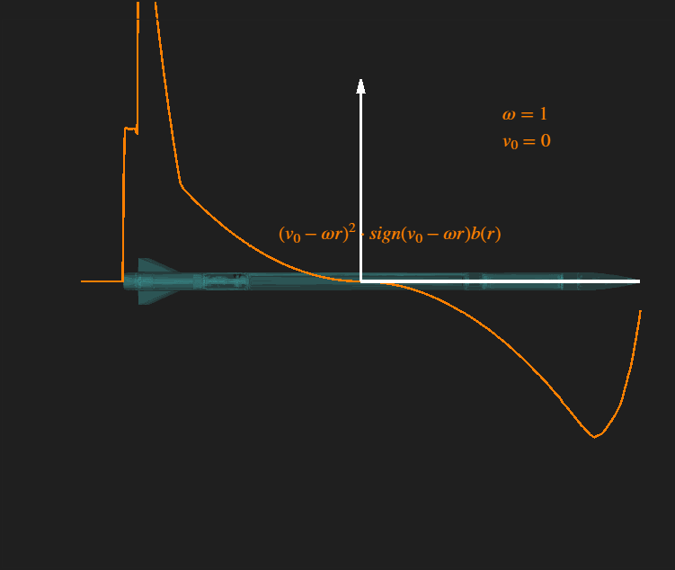
> *Fig 6: integrand for different $v_0, \omega$*

The shape of the curve is somewhat remeniscent of a cubic polynomial. The general shape of which 
can be written as $ (v_0 - \omega \cdot r)^3$, in essence approximating $sign(v) = v$ to capture the odd nature of $sign(v)$:

> *Fig 7: integrand for different $v_0, \omega$*

To make the polynomial into a good approximation, it's normalised with $ |v_0 - \omega \cdot r_{ref}| $ 
to normalise the magnitude to that of the initial integrand, and to get the dimensions to agree.

The approximation is not perfect, as can be seen in Fig 7. There are combinations of $v_0, \omega$ 
that yield wildly different results than the original, though in the persuit of computational 
efficiency this model will employ it regardless. For most combinations it yields a relatively 
good result, and as will be discussed later, this will still give a better result than that of 
the center-of-pressure model.

This yields the approximation as:

$$\begin{align} (v_0-\omega r)^2\cdot sign(v_0-\omega r)b(r) \approx \frac{(v_0 - \omega r)^3}{|v_0 - \omega r_{ref} |} b(r)
\end{align}$$

Where $r_{ref}$ is some reference-radius, which can be found impirically through testing and 
plotting. The reference-radius used in this article is $r_{ref} = 0.5\cdot r_{max}$, where $r_{max}$ 
is the maximal radius on the body (in the case of the rocket above, the tip of the nosecone).

<h3>Seperation of integral terms.</h3>

Substituting the approximation into the moment equation:

$$ \begin{align} M &= \int_{R} r \frac{1}{2} C_d \rho (v_0 - \omega r)^2 sign(v_0 - \omega r) b(r) \partial r \\
&\approx \int_{R} r \frac{1}{2} C_d \rho \frac{(v_0 - \omega r)^3}{ |v_0 - \omega r_{ref} | } b(r) \partial r \\
&= \frac{1}{2} \frac{C_d \rho}{ |v_0 - \omega r_{ref} | } \int_{R} r (v_0 - \omega r)^3 b(r) \partial r \end{align}$$

Now the expression is in a form that can be expanded, and doing so reveals how the terms can be seperated out:

$$ \begin{align} M &= \frac{1}{2} \frac{C_d \rho}{ |v_0 - \omega r_{ref} | } \int_{R} r (v_0 - \omega r)^3 b(r) \partial r \\
&\vdots\\
&= \frac{1}{2} \frac{C_d \rho}{ |v_0 - \omega r_{ref} | } \int_{R} r (v_0^3 - 3v_0^2\omega r + 3v_0 \omega^2 r^2 - \omega^3 r^3) b(r) \partial r \\
&= \frac{1}{2} \frac{C_d \rho}{ |v_0 - \omega r_{ref} | } \int_{R} r \begin{pmatrix} v_0^3 & -3v_0^2\omega & 3v_0 \omega^2 & -\omega^3 \end{pmatrix} \cdot \begin{pmatrix} r^0 & r^1 & r^2 & r^3\end{pmatrix} b(r) \partial r \\
&= \frac{1}{2} \frac{C_d \rho}{ |v_0 - \omega r_{ref} | } \int_{R} \begin{pmatrix} v_0^3 & -3v_0^2\omega & 3v_0 \omega^2 & -\omega^3 \end{pmatrix}\cdot \begin{pmatrix} r^1 & r^2 & r^3 & r^4 \end{pmatrix} b(r) \partial r \\
&= \frac{1}{2} \frac{C_d \rho}{ |v_0 - \omega r_{ref} | } \begin{pmatrix} v_0^3 & -3v_0^2\omega & 3v_0 \omega^2 & -\omega^3 \end{pmatrix}\cdot\int_{R}  \begin{pmatrix} r^1 & r^2 & r^3 & r^4 \end{pmatrix} b(r) \partial r \end{align}$$

Thus, all the simulation-terms have been brought outside the integral, allowing for computation 
of the integral in a single instance to compute the coefficients, and then reuse them during simulation. 
The integral-terms will henceforth be shorted to:

$$ \mathbb{A} = \int_{R} \begin{pmatrix} r^1 & r^2 & r^3 & r^4 \end{pmatrix} b(r) \partial r$$

Or, using index notation:

$$ \mathbb{A}_{k} = \int_{R} r^k b(r) \partial r,k = 1,2,3,4 $$

The reason for choosing $\mathbb{A}$ will soon become apparent, as it's components have a physical 
interpretation. The reason for treating it as a tensor instead of a vector will later also become 
apparent when the model is generalized to 3 dimensions.

The moment-equation thus conveniently becomes:

$$ M = \frac{1}{2}C_d \rho \mathbb{A}\cdot \frac{\begin{pmatrix}v_0^3 & -3v_0^2\omega & 3 v_0 \omega^2 & -\omega^3 
\end{pmatrix}}{|v_0 - \omega r_{ref} |}$$

Which is still remeniscent of the original force-equation given by NASA. 

The $v_0, \omega$-term will henceforth also be shorted to $\mathbb{V}$ such that:

$$ \mathbb{V} = \frac{\begin{pmatrix}v_0^3 & -3v_0^2\omega & 3 v_0 \omega^2 & -\omega^3 
\end{pmatrix}}{|v_0 - \omega r_{ref} |}$$

Thus:

$$M = \frac{1}{2}C_d \rho \mathbb{A}\cdot \mathbb{V}$$

<h3>Physical interpretation of A.</h3>

This section will focus on building physical intuition and understanding on why this is the case, 
but is not necessary for implementation. 
Further details about implementation follow after this section.

Plotting each integrand-term individually:

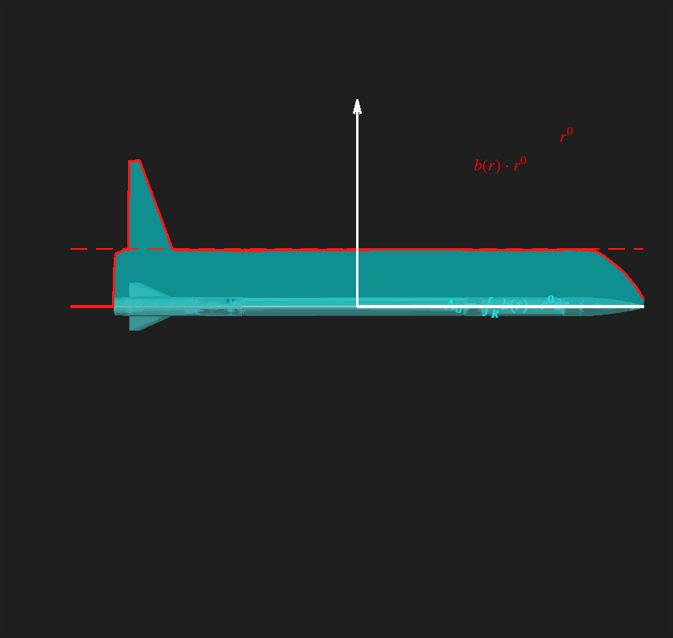
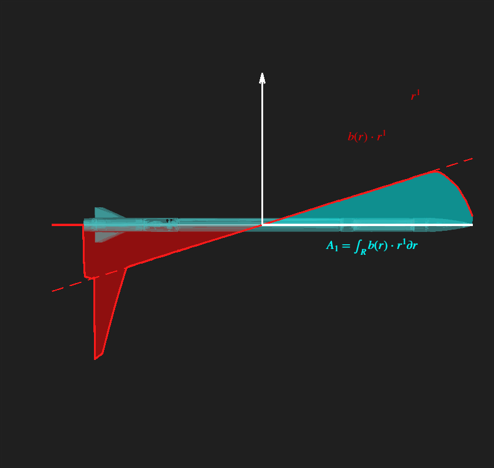
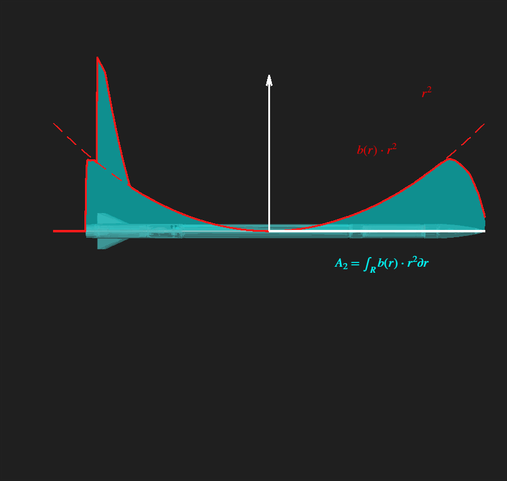
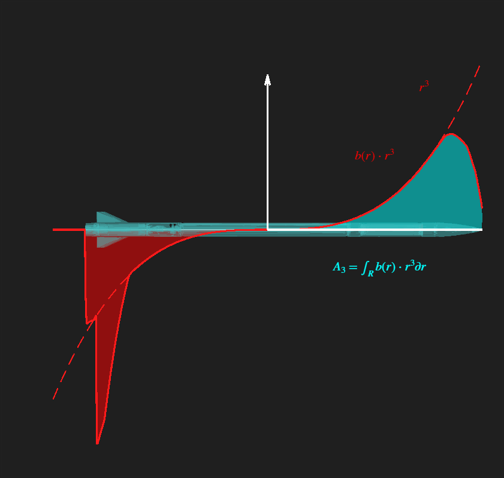
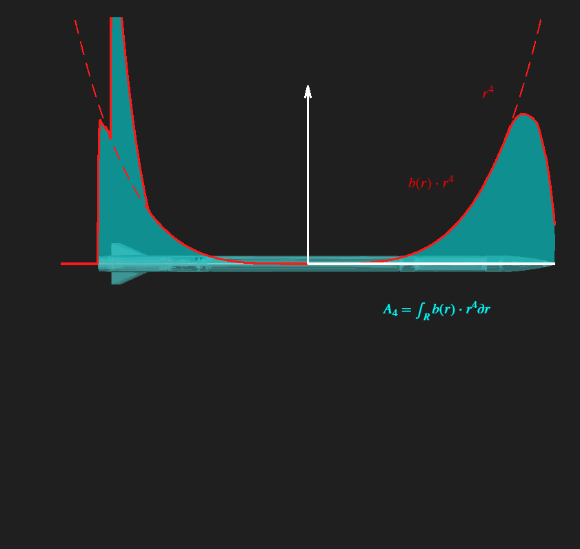
> *Fig 8: A-terms*

The integral of the above correspond to all the different area-moments of the body. The 0'th term, 
$r^0$-term when integrated just gives rise to the area of the body, while the 1'st term gives 
rise to the 1'st area-moment.

(The 1'st area-moment can be described as the product between the area and the 
center-of-area/center-of-pressure):

$$ c_A = \frac{\int_{R} r^1 b(r) \partial r}{\int_{R} b(r) \partial r} = \frac{\mathbb{A_1}}{A} 
\Longleftrightarrow \mathbb{A_1} = c_A \cdot A$$

Thus the 1'st area-moment can be thought of as the center-of-area.

The 2'nd term, $r^2$, when integrated, gives rise to the second area-moment. A good way to think about 
the second area moment is as a metric for how far away from the center the area of the body is distributed. 
One other application where this shows up is in solid-mechanics and in beam-theory, as a beams ability to 
resist bending is proportional to how far away from the centerline its cross-section is distributed 
(think I-beams with a lot of area far away from the center).

The 3'rd area-moment is very similar to the 1'st, but more weighted towards its extremes/edges, same 
with the 4'th, in that it's similar to the 2'nd, just weighted more at its extremes.

<h4>Odd terms.</h4>

In general all the even terms behave very similarly, just getting progressively more and more weighted 
towards the extremes.

Also, the odd terms when integrated tend to give a low output, as the negative parts of the curve 
cancel out major portions of the positive. Thus the only remainder is that which is not cancelled out. 

A way to interpret this is that the negative terms describe how unsymmetric the body is around 0, 
where a high result means the body is very unsymmetric, and the sign reveals whether the area is 
centered more to the positive or to the negative. 
In the rocket example above, the integral will come out negative, as the fin presents a large unsymmetry 
that is not there in the fwd-section, and thus will not be cancelled.

This will turn out to be significant.

<h4>Even terms.</h4>

Similarly, all the odd terms behave similarly, just getting weigted towards the extremes as well.

A way to interpret the even terms is as stated previously, is as a metric for how scewed the area 
is towards the extremes, as opposed to centered around the middle.

This will also turn out to be significant.

<h4>Terms corresponding to each area-moment.</h4>

Putting the terms of $\mathbb{V}$ corresponding to each area-moment $\mathbb{A}_k$ in a table reveals something interesting:

$$
\begin{Vmatrix}
\mathbb{A}_1  & v_0^3 \\
\mathbb{A}_2 & -3 v_0^2 \omega \\
\mathbb{A}_3 & 3v_0 \omega^2 \\
\mathbb{A}_4 & -\omega^3 \\
\end{Vmatrix}
$$

All the even $\mathbb{A}_k$ terms correspond to terms where $ \omega $ is odd and $v_0$ is even, 
while all the odd $\mathbb{A}_k$ terms correspond to terms where $ \omega $ is even and $v_0$ is odd.

<h4>Terms corresponding to v_0.</h4>

What is noteworthy is that all the odd terms of $\mathbb{A}_k$ correspond to terms where $v_0$ is 
odd, i.e the sign of $v_0$ is conserved. This means that the wind-velocity normal to the surface 
gives rise primarily to a moment proportional to the ammount of unsymmetry on the surface. What's 
more, the sign of $\mathbb{A}_k$ determines whether or not that moment is positive or negative, which
makes intuitive sense when one consideres the fact that the sign of $\mathbb{A}_k$ encodes for which side of
0 the unsymmetry is located.

<h4>Terms corresponding to omega.</h4>

In contrast to $v_0$, what is noteworthy about $\omega$ is that instead all the even terms of $\mathbb{A}_k$ 
correspond to terms where $\omega$ is odd, i.e the sign of $\omega$ is conserved. Not only are all
the even terms of $\mathbb{A}_k$ strictly positive because of the underlying even exponent, which means that
the moment resulting from $\omega$ is only proportional to how much the area is scewed to the extremes,
what's more is that all the terms where $\omega$ is odd have a minus-sign, meaning that all the moments resulting
from $\omega$ work to contradict $\omega$. This also makes intuitive sense when one considers the reason for 
including the $\omega r$ term initially, i.e to dampen oscillations.

<h3>Vectorization.</h3>

Vectorizing requires being more rigorous with the moment's direction $\vec{M}$, and the direction of the $\vec{\omega}$-vector
and the $\vec{r}$. Consider the moment around one of the faces $i$, along one axis $j$: $\vec{M}_{i,j}$:

Let $\vec{A}$, $\hat{a}$ be the vector and corresponding unit vector normal to the area.

Let $\hat{r}$ be the unit vector along the axis of integration (normal to $\hat{a}$, naturally).

Let $\hat{e}_1,\hat{e}_2,\hat{e}_3$ be a body-fix orthonormal basis (aligned with $\hat{a},\hat{r}$).

Setting up the moment-equation once more:

$$\begin{align} 
\vec{M}_{ij}
&= \int_{R} r\cdot \hat{r}_j\times \partial \vec{F}_i \\
&= \hat{r}_j \times \hat{a}_i \int_{R} \frac{1}{2} \;\rho \; C_{l,ij} \;\partial A \; v^2 \; \text{sign}(v) \\
&\vdots \\
&= (\hat{r}_j \times \hat{a}_i) \mathbb{A}_{ij}\cdot \begin{pmatrix} v_{0i}^3 & -3v_{0i}^2\omega_{ij} & 3 v_{0i} \omega_{ij}^2 & -\omega_{ij}^3 \end{pmatrix} \cdot  D_{ij} \\
&= -(\hat{a}_i \times \hat{r}_j)   \mathbb{A}_{ij}\cdot \begin{pmatrix} v_{0i}^3 & -3v_{0i}^2\omega_{ij} & 3 v_{0i} \omega_{ij}^2 & -\omega_{ij}^3 \end{pmatrix} \cdot D_{ij} \\
&= -(\hat{a}_i \times \hat{r}_j)  \sum_{t=1}^{t=4} \mathbb{A}_{ijt}\mathbb{V}_{ijt} \cdot D_{ij}
\end{align}$$

Where:

$$\vec{v}_0 = \sum_{i=1}^{i=3} v_{0i}\hat{e}_i \qquad  v_{0i} = \sum_{t=1}^{t=3}v_{0t}\delta_{it}$$

$$\vec{\omega}_0 = \sum_{i=1}^{i=3} \omega_{0i}\hat{e}_i \qquad \omega_{ij} =\sum_{t=1}^{t=3} \omega_{t} (1-\delta_{ij}) $$

$$ \mathbb{V}_{ij1} = v_{0i}^3 \qquad \mathbb{V}_{ij2} = -3v_{0i}^2\omega_{ij} \qquad \mathbb{V}_{ij3} = 3 v_{0i} \omega_{ij}^2 \qquad \mathbb{V}_{ij4} = -\omega_{ij}^3 $$

$$ \mathbb{A}_{ijt} = \int_{R_j} r^t b_{ij}(r) \partial r \qquad t = 1,2,3,4$$

$b(r_{ij})$ is the width-function for surface i along axis j. $b(r_{ij})\delta_{ij} = 0$.

Henceforth index-notation will be used in isolation as the number of indices grows.

Let: 

$$\vec{M}_{ij} = \sum_{k=1}^{k=3}\hat{e}_k M_{ijk} $$

$$ M_{ijk} = -\epsilon_{ijk} \sum_{t=1}^{t=4} \mathbb{A}_{ijt}\mathbb{V}_{ijt} \cdot C_{l,ij}$$

Thus, for the total moment around the entire body, $\vec{M}$:

$$\vec{M} = \sum_{k=1}^{k=3} \hat{e}_k M_{k}$$

$$\begin{align}
M_k 
&= \sum_{i=1}^{i=3}\sum_{j=1}^{j=3} M_{ijk} \\
M_k &= \sum_{i=1}^{i=3}\sum_{j=1}^{j=3} -\epsilon_{ijk} \sum_{t=1}^{t=4} \mathbb{A}_{ijt}\mathbb{V}_{ijt} \cdot C_{l,ij} 
\end{align}$$

Intepretation of the above equation yields that all the aerodynamic tendensies of the body can be described using the $\mathbb{V}$-tensor, which, from the equation, has rank 3. That is to say, all the aerodymamic characteristics of the body can be described by packaging them into a $3x3x4$-tensor. The 1'st dimension correspond to the dimension of the surface, i.e which direction its normal-vector is pointing, the 2'nd dimension correspond to the spatial axis of integration, the 3'rd correspond to the degree of the area-moment.
